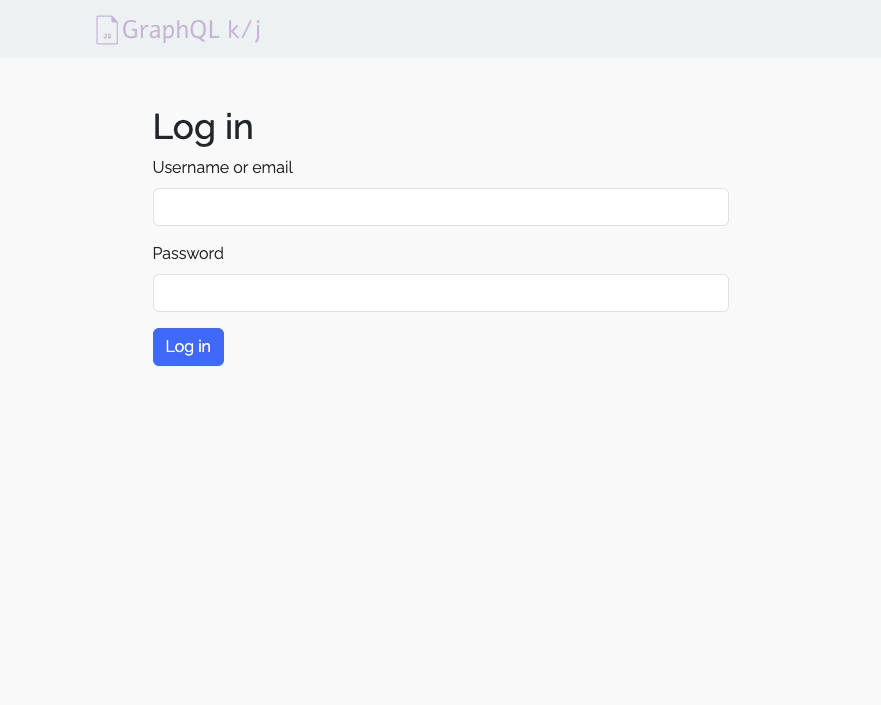
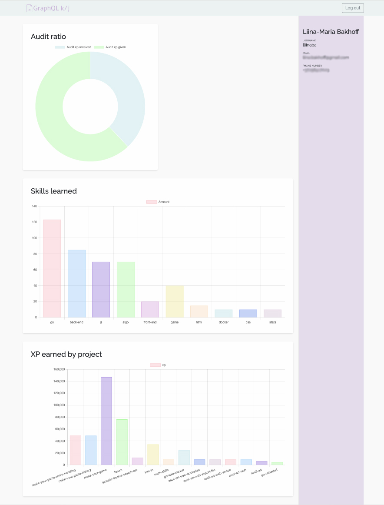

# GraphQL Profile Project

The GraphQL Profile Project is a web-based application that provides users with a detailed profile view showcasing achievements, XP, audit ratios, and other statistics. This project emphasizes data visualization and interactivity through charts, offering users insights into their progress and accomplishments.




## Objective

The objective of this project is to create a user profile page by querying data from a GraphQL API. The profile page showcases essential user information, including identification, XP, audit ratio, grades, and other school-related achievements. It also features a statistics section with interactive graphs, built using SVG and JavaScript, to visualize progress and achievements.

## Features

-   **Login Page**: Authenticates the user via JWT, supporting both `username:password` and `email:password` formats.
-   **Profile Display**: Displays user information, such as username, email, XP, audit ratios, and other attributes.
-   **Statistics Section**: Generates at least two different types of charts to visualize data, such as XP progression and audit ratios, using SVG and Chart.js (via CDN).
-   **GraphQL Queries**: Utilizes standard, nested, and argument-based GraphQL queries for dynamic data retrieval.

## Project Structure

-   **Frontend**: HTML, (S)CSS (with Bootstrap toolkit), and JavaScript (no frameworks), using Chart.js for graph rendering via CDN.
-   **Authentication**: Secure access via JWT, with tokens stored in `localStorage`.
-   **GraphQL**: Queries data from tables such as `user`, `transaction`, `progress`, and `result` to render relevant user information.

### Main Files

-   **`index.html`**: The main HTML page, containing links to required CSS and JavaScript files.
-   **`index.js`**: Initializes and routes the application, rendering components based on user authentication status.
-   **`Home.js`**: Fetches and renders user profile data and charts.
-   **`LogIn.js`**: Manages user login, including JWT retrieval from the API.
-   **`Navbar.js` and `NotFound.js`**: Manages navigation and error page rendering.

### User Flow

1. The user logs in using either a username or email.
2. Upon successful authentication, a JWT is stored to maintain session persistence.
3. The profile page loads, displaying user data and interactive charts based on GraphQL query results.

## GraphQL Queries

1. **Basic Queries**: Retrieves essential user data (ID, login) from the `user` table.
2. **Nested Queries**: Accesses audit ratios via the `transaction` and `user` tables.
3. **Parameterized Queries**: Filters data by parameters, such as `objectId`, to retrieve specific records from the `object` table.

### Example Queries

```graphql
{
	user {
		id
		login
		email
	}
}

{
	result {
		id
		user {
			id
			login
		}
	}
}

# Parameterized Query Example
{
	object(id: "123") {
		name
		description
	}
}
```

## Hosting

The project is hosted on GitHub Pages.

## Authors

Miikael Volkonski | Discord: tokintmash

Liina-Maria Bakhoff | Discord: liinabakhoff
